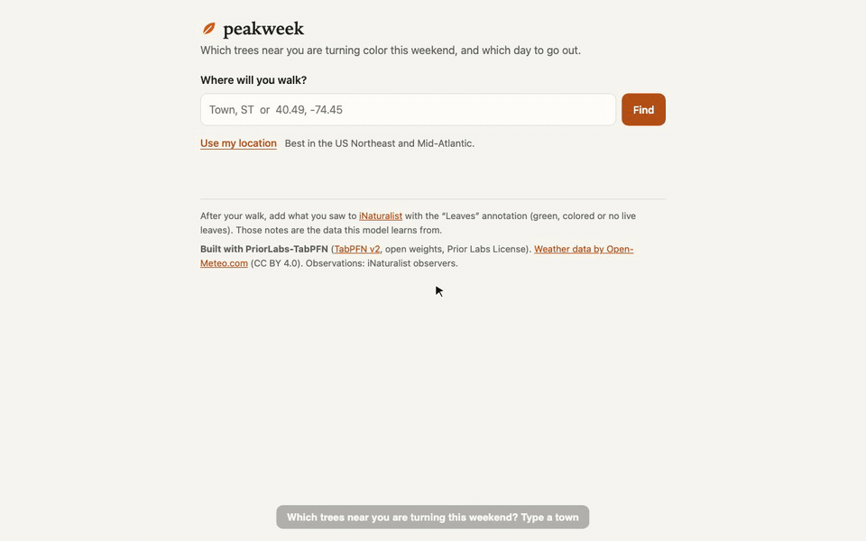

# peakweek

**Which trees near you are turning color this weekend, and which day should you go out?**

**Built with PriorLabs-TabPFN.** peakweek forecasts fall color for 8 common trees in the US Northeast and
Mid-Atlantic from 6,650 iNaturalist community-science observations and this season's weather, using the open
TabPFN v2 weights on a plain CPU. The answer is one card you can print, and then you go outside.



*The waiting part (about a minute of TabPFN on a 4-core CPU) is sped up in the GIF. Full video: [docs/demo.mp4](docs/demo.mp4).*

## Live site

**<https://bowen1314.github.io/peakweek/>**: search a town or press **Use my location**; nothing to install.

- **Updated daily.** Every morning (around 10:20 UTC, about 6:20 in New York) a GitHub Actions job
  (`.github/workflows/pages.yml`, `scripts/build_site.py`) fetches this season's weather from Open-Meteo, runs
  TabPFN once on the runner's CPU for every grid cell below, and publishes the cards to GitHub Pages. There is
  no server: the page finds the cell around your place in `data/index.json` and shows that cell's card. "Today"
  is the New York date. If a build fails (for example the weather API is down), nothing is published and the
  site keeps the previous day's cards; every card says the day it was made.
- **1-degree grid approximation.** One forecast per 1-degree grid cell (about 110 x 80 km), the same cells the
  weather already comes from. A cell's forecast is made at its *weather point*: the mean coordinate of the
  cell's training observations, i.e. the point the model's weather for that cell has always come from, with
  that point's elevation (Open-Meteo elevation API). The "rarely recorded within 50 km" check is also for that
  point (iNaturalist, counted once on 2026-10-06: `data/nearby_cells.json`, `scripts/build_nearby.py`). The
  card names the place you searched and says so, for example "Forecast made Wed, Oct 7 for the 1° grid cell
  around 40.59, -74.45; updated daily." For your exact spot (your own elevation and local tree check), run it
  locally.
- **Which cells.** A cell gets a forecast if the training data has observations in it: 103 of the 150 cells
  that touch the region. The other 47 have no observation at all (open Atlantic and Gulf of Maine, and
  thinly populated land along the edge of the box in northern Maine, Quebec and Ontario); the page says there
  is no forecast there. Outside the region the page says so instead of extrapolating.
- **Same model, same numbers.** The model is fitted once with the locked settings and predicts all cells'
  rows in one batch (the shared context does not depend on the place). Before publishing, each build re-runs
  4 cells through the ordinary single-point `forecast(lat, lon)` and stops unless every probability matches
  the batch within 1e-5 with identical verdicts and headline (`data/check.json` on the site).
  On the free 4-core GitHub runner the two builds on 2026-10-06 took 16.5 and 7.3 minutes in all (runner
  speed varies): about 2 minutes of weather (10 multi-location Open-Meteo requests), 10.3 and 3.1 minutes
  for TabPFN to predict all 12,360 rows (103 cells x 8 species x 15 days, peak memory about 900-950 MB) and
  2.5 and 0.7 minutes for the check (4 single-point forecasts). The largest difference between batch and
  single-point probabilities was 0 both times.
- `python3 scripts/build_site.py --fake --out /tmp/site` builds the whole site with synthetic weather and a
  fake classifier (no model, no network, marked synthetic on every card), to check the page.

## How the forecast works

peakweek answers "if someone photographs a red maple near me on Saturday, will its leaves be green,
colored or gone?" for 8 common fall-color trees (red maple, sugar maple, sweetgum, northern red oak,
American beech, black gum, sassafras, Norway maple) and each of the next 15 days.

1. **Training data.** Community scientists on iNaturalist annotate tree photos with a leaf state
   ("Green Leaves", "Colored Leaves", "No Live Leaves"). We pulled every annotated observation of the 8
   species in the US Northeast and Mid-Atlantic box (lat 38.5-47.5, lon -80.5 to -66.9), Sep-Nov 2018-2025,
   kept research-grade/needs-ID wild observations with precise, unobscured coordinates and an open license:
   6,650 observations (3,457 green, 2,846 colored, 347 no live leaves; `data/observations.csv`).
2. **Weather features.** For each observation we compute, from Open-Meteo's ERA5 archive at the observation's
   1-degree weather cell: chilling degree days since Sep 1, frost nights (<= 0 C, <= 5 C), last-week minimum
   temperature, two-week mean temperature, 30-day precipitation, and how much warmer or colder this fall has
   been than the same cell's other years. Plus species, latitude, longitude, elevation, day of year and day
   length. The same code (`peakweek/features.py`) builds the app's rows: this season's days up to yesterday
   come from the same ERA5 archive (Sep 1 to yesterday; the archive lags by a day or so), and today plus the
   next 14 days come from Open-Meteo's forecast API (`past_days=92`, `forecast_days=16`). We do not use the
   forecast API for the past: in Sep 2026 its past-days precipitation ran ~2.3 mm/day below ERA5 and it
   returned only ~50 of the 92 past days (`eval/weather_shift.py`).
3. **Model.** TabPFN v2 (Prior Labs' open-weight tabular foundation model, ~29 MB, CPU) predicts the
   three probabilities in context: at prediction time it is shown 1,000 labeled rows and the query rows,
   with no gradient training. Context selection: 1,000 training rows drawn evenly across species x
   leaf-state strata (at least 8 rows per stratum), done three times with different seeds and the three
   predictions averaged (4 estimators each). We picked this on 2024 data over one context per species,
   nearest-neighbour contexts per place and week, calendar-only features, fewer weather features,
   8 estimators, and a single context.

### How good is it?

We held out whole years. Settings were chosen on 2024 (trained on 2018-2023), then frozen
(`eval/locked.json`), and the model was scored **once** on 2025 (trained on 2018-2024; 1,725 observations).
Lower is better for log loss and Brier score.

| model (2025 test) | log loss | Brier | accuracy |
|---|---:|---:|---:|
| **TabPFN v2, all features** | **0.498** | **0.285** | 0.805 |
| Gradient-boosted trees (sklearn HGB), all features | 0.505 | 0.291 | 0.802 |
| TabPFN v2, calendar features only (ablation) | 0.516 | 0.291 | 0.800 |
| Logistic regression, all features (best baseline on 2024) | 0.519 | 0.289 | 0.805 |
| Logistic regression, species + day of year + latitude | 0.552 | 0.307 | 0.795 |
| Climatology (species x week frequencies) | 0.581 | 0.345 | 0.752 |

- TabPFN beats the baseline we committed to in advance (logistic regression) by 0.021 log loss, 95% paired
  bootstrap CI [-0.035, -0.007] over observations and [-0.041, -0.003] over grid-cell x week clusters.
- It is ahead of gradient-boosted trees too, but that gap (-0.007, CI [-0.020, +0.007]) is not significant.
- The weather features matter: the same TabPFN with only species, place and date is 0.018 worse
  (CI [-0.026, -0.011]).
- Honest caveats: every model got worse from 2024 to 2025, so year-to-year shift is bigger than the gaps
  between good models; TabPFN is not best for every species (oaks, black gum, sweetgum and sassafras are
  better served by simpler models); accuracy is ~0.80 for all decent models, so the gain is in calibrated
  probabilities. Labels are what iNaturalist photographers chose to photograph and annotate, which
  under-represents bare trees. Full tables, every validation run and timings: `eval/RESULTS.md`.
- One forecast (8 species x 15 days = 120 rows) takes about 51-58 s on a 4-core CPU with no GPU once warm
  (99 s for the first forecast after the server started), peak process RSS about 670 MB, under an 800 MB memory cap.

## Run it

The app (page, server, CLI, card) is Python standard library only (3.9+). The live forecast also needs the
model's dependencies from `requirements.txt` (TabPFN v2 on CPU); without them you can still run everything
against a saved forecast.

**Try it without the model.** `examples/` has real forecasts saved on 2026-10-06 (TabPFN on a CPU) for
New Brunswick NJ, Burlington VT and Pittsburgh PA. The server replays one of them for any search, and the card
says so ("Replaying a saved forecast for New Brunswick, NJ (made Oct 6)", or "You searched Ithaca, NY; this is
the saved forecast for New Brunswick, NJ" when you search somewhere else):

```bash
python3 server.py --fixture examples/forecast_new_brunswick.json   # open http://127.0.0.1:8770/
python3 -m peakweek --fixture examples/forecast_burlington.json      # the same card in the terminal
```

(`examples/forecast_fixture.json` is a hand-made forecast used by the tests; the page labels it "synthetic".)

**Live forecast** (fetches weather since Sep 1 plus a 2-week forecast from Open-Meteo, then runs TabPFN; about
a minute on a 4-core CPU: 51-58 s measured once warm, 99 s for the first forecast after the server started):

```bash
pip install torch --index-url https://download.pytorch.org/whl/cpu   # CPU-only torch
pip install -r requirements.txt "tabpfn==9.1.0"                       # Python 3.10+
python3 server.py                                  # http://127.0.0.1:8770/
python3 -m peakweek "New Brunswick, NJ"            # or: python3 -m peakweek --lat 40.49 --lon -74.45
```

- Search a town ("Ithaca, NY"), type coordinates ("40.49, -74.45"), or press **Use my location**.
- The page shows what the server is doing while it waits, then one card. **Print card** gives a single
  black-and-white page; **Done, go outside** shrinks the page to the one-sentence headline.
- `server.py` options: `--host` (default `127.0.0.1`, this machine only), `--port` (default `8770`),
  `--fixture PATH`, `--fixture-delay SECONDS` (pretend a saved forecast takes that long, to see the waiting state).
- The server computes one forecast at a time (memory) and queues the rest; finished forecasts are cached in
  memory per place (rounded to 0.01 degrees) and day. TabPFN is only imported when the first live forecast runs.
- Place search uses the keyless Open-Meteo geocoding API, cached in `.cache/geocode.json`.
- For each place asked about, one keyless iNaturalist call counts research-grade observations of the eight
  trees within 50 km (cached per 0.01-degree cell in `.cache/nearby/`). It runs beside the forecast, never on
  the forecast thread; if iNaturalist does not answer within 10 s the card says the local check was unavailable.
  With `--fixture`, the CLI and the server both check the fixture's own place, to match the numbers on the card.

API (all `GET`, JSON): `/api/geocode?q=`, `/api/forecast?lat=&lon=&name=` (starts or reuses a job),
`/api/forecast/status?id=` (when done: the annotated forecast and the card HTML), `/api/info`.

**Tests** (no network, no model): `python3 -m unittest discover -s tests -t .` (the core's tests need numpy,
pandas and scikit-learn; one test runs real TabPFN only when `PEAKWEEK_RUN_TABPFN=1`).
The app's tests are `tests/test_verdict.py`, `test_card.py`, `test_geocode.py`, `test_nearby.py`, `test_cli.py`
and `test_server.py`; the daily site's are `test_site.py` and `test_static_mode.py` (the page's static-mode
helpers run under node, if installed, and are compared with the Python they mirror).

**Demo screenshots, GIF and video** (needs Google Chrome and ffmpeg):

```bash
python3 server.py                                                              # or --fixture ... --fixture-delay 8
node --experimental-websocket scripts/record_demo.mjs                           # WAIT_SPEEDUP=10 for a live run
```

This writes `docs/screenshots/` (desktop 1280 px and phone 390 px: search, waiting, card, print preview,
"go outside"; plus `print-card.pdf`) `docs/demo.gif` and `docs/demo.mp4`, in which the waiting part is sped up and captioned so.

## How the card decides

The model gives, for each species and each of the next 15 days, the chance that an observation of that
species shows green leaves, fall color, or no live leaves. The card never changes those numbers; it only
summarizes them, using the forecast's own dates (never the clock), so a saved forecast always reads the same.

- **This weekend** is the next Saturday and Sunday in the 15 days (if today is Saturday, today and tomorrow;
  if today is Sunday, just today). A species' weekend numbers are the average of those days.
- **Best day** is the day with the highest chance of fall color (ties go to the earliest day).
- **Verdict**, first rule that matches:

  | Verdict | Rule (weekend numbers) |
  |---|---|
  | **Late** | chance of no live leaves is 35% or more |
  | **Go** | chance of fall color is 50% or more |
  | **Late** | color is already fading: the best day is today or before the weekend, and from it to the weekend color falls while bare branches rise |
  | **Starting** | chance of fall color is 25% or more |
  | **Wait** | otherwise; the card says when color is most likely ("best around Sat, Oct 17", or "mostly green through ...") |

- **Headline**: one sentence naming up to three "go" species (most colorful first) and one species to come
  back for: the starting or waiting species with the earliest best day after the weekend, among those whose
  best chance of color is at least 25%. With no "go" species it names the ones starting to turn (or the late
  ones still showing color). Outside the region the model was trained on (US Northeast and Mid-Atlantic) the
  headline starts with "Rough guide only" and the card shows the region note.
- **Rarely recorded here**: a tree with fewer than 5 research-grade iNaturalist observations within 50 km keeps
  its verdict and numbers, but its text starts with "Rarely recorded within 50 km", it is listed last and dimmed,
  and the headline never names it.
- **Wording**: a chance is read per tree, "about 7 in 10 red maples you find should show fall color", not as
  a share of the canopy. Each row also shows the weekend split in tenths (for example "3 green, 6 color,
  1 bare") so the card still reads correctly when printed in black and white.

## Repo layout

```
server.py                 local web server + JSON API (stdlib only; TabPFN imported lazily)
static/                   the page (no external assets; static mode for the GitHub Pages site)
peakweek/                 species, inat, weather, features, dataset, model, baselines, metrics, forecast   (core)
                          verdict, card, fieldnotes, geocode, nearby, cli                                  (app)
                          site (the daily static site: cells, batch forecast, batch = single check)
data/                     observations.csv, features.csv, climatology.csv + README (provenance, filters, counts)
                          nearby_cells.json (iNaturalist 50 km counts per published cell, fetched once)
.github/workflows/        pages.yml: daily build + GitHub Pages deploy
eval/                     backtest.py, live_check.py, RESULTS.md (every run), locked.json, runs.jsonl, preds/
examples/                 saved real forecasts (New Brunswick, Burlington, Pittsburgh) + a synthetic test fixture
scripts/                  build_dataset.py, build_site.py, build_nearby.py, make_examples.py, record_demo.mjs
licenses/, NOTICE         TabPFN v2 license and attributions
```

## Limitations

- Labels are what iNaturalist users chose to photograph and annotate. Bare trees are rare in the data (347 of
  6,650), so the chance of bare branches stays small even late in the window: the card is better at "not yet"
  than at "too late", and in early October the best day is often the last day of the forecast.
- Weather is per 1-degree grid cell; elevation is a feature, but a cold hollow and a sunny ridge in the same
  cell get the same weather.
- Most data is recent (2024 and 2025 are 65% of the rows). Year-to-year shift is larger than the gaps between
  the good models (see `eval/RESULTS.md`).
- Trained only on the US Northeast and Mid-Atlantic and on 8 species. Elsewhere the card says it is a rough guide.
- The "look for" lines are short general descriptions, not an identification key.

## Credits and license

Code: MIT (`LICENSE`). Model: TabPFN v2 by Prior Labs (Hollmann et al., *Nature* 637, 319-326, 2025), Prior Labs
License 1.1 (Apache 2.0 + attribution), downloaded at runtime and not redistributed. Observations: iNaturalist
contributors, each under the license recorded in `data/observations.csv`. Weather data by
[Open-Meteo.com](https://open-meteo.com/) (CC BY 4.0), ERA5 by the Copernicus Climate Change Service. Elevation:
NASA SRTM via OpenTopoData, and the Open-Meteo elevation API. Details in `NOTICE` and `data/README.md`.

Built in October 2026 (started October 6) for the DEV Hacktoberfest Open-Source AI Challenge, Week 1 "Touch
Grass", with AI coding agents (Claude Code). Any commit after the deadline (October 11, 2026, 11:59 PM PDT) will
be listed here.
